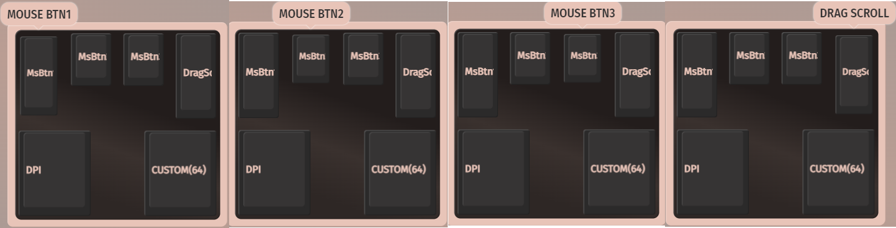

# Adept Trackball Custom – QMK/VIA Firmware 

Adept Trackball Custom は、Adept Trackball（Ploopy）をベースに、独自にカスタマイズしたQMK/VIA ファームウェアを使用するトラックボールです。
このリポジトリでは、Adept Trackball Custom で使用しているファームウェア（キーマップ）のソースコードを公開しています。
また、Adept Trackball Custom の使用方法についても説明します。

## キーマップについて

Adept Trackball Custom では、QMK/VIA を用いて独自のキーマップを構成しています。
デフォルトレイヤーでは一般的なトラックボール操作を行い、Fn レイヤーでは
DPI 切り替えやスクロールモードの切り替えなど、追加の機能を利用できます。

現在のキーマップを確認するには、[VIA](https://usevia.app/) を使用します。
Adept Trackball Custom を PC に接続すると、VIA が自動的に認識します。
もし認識されない場合は、USB の抜き差しや VIA の再起動を試してください。

以下はデフォルトレイヤー（Layer 0）のキーマップです。
VIA の仕様上、キーの割り当てはマウスオーバー時に表示されるため、
主要なキーについては個別にキャプチャを掲載しています。
一部のキーは VIA 上で「CUSTOM(64)」と表示されますが、
これは VIA が該当キーコードの名称を持っていないためです。
実際にはレイヤー切り替え機能が割り当てられています。

